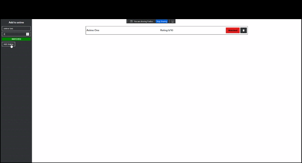

# Simple Fullstack App - CRUD
This simple project allows the user to add an Anime to a list that will display it on the screen. With this simple app it allows use to keep track of anime they have watched or want to watch.

## How It's Made:

**Tech used:** HTML, CSS, JavaScript, Node.js, Express, ejs, adn MongoDB

In this project I wanted to create a CRUD API, so with that in mind I had to create a server that will listen for request but rather than doing this manually I used express. Than I needed a place to store the data which lead me to use MongoDB. Html was not doing it for me, I wanted a more lively app which lead me to use EJS to allow a more dynamic page.

## Optimizations

After finishing this project I realize that it will be shared with every person that uses it 😂. I defenatly want to remake this app bigger and better. Rather than making the user input a rating I want it to grab info from an api that has the Anime Info. I also want to add a sign in option that will create a DB for each user, or allow it to be stored localy, so the app is not being shared by everyone.

## Lessons Learned:

With this project I learned how to use express, mongoDb, node.js, and ejs. It also gave me a better understaning of express and node.js.